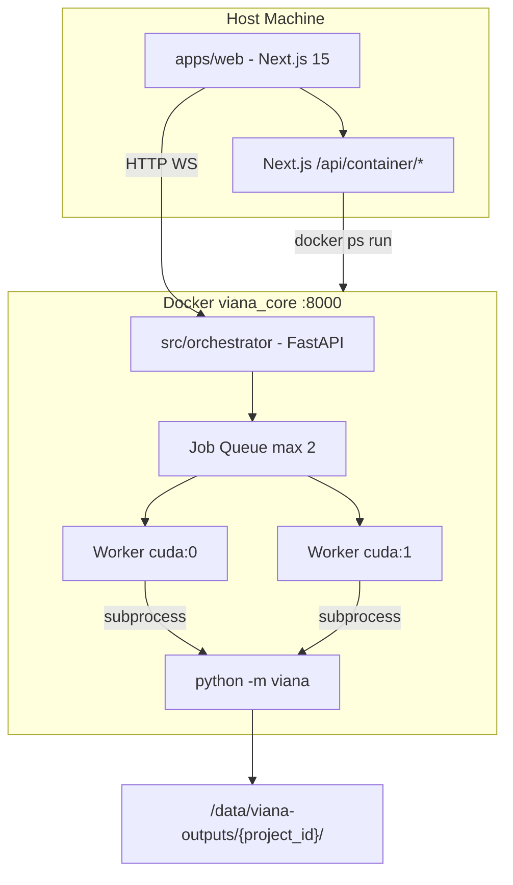

# System Architecture — ViAna v2

**Status:** `docs/PROJECT_STATUS.md`  
**Contracts:** `packages/contracts/`

---

## 1. Runtime topology



## 2. Package boundaries

| Package | Runs on | Must not import |
|---------|---------|-----------------|
| `src/viana` | Container (GPU) | fastapi, next |
| `src/orchestrator` | Container | ultralytics in route handlers (use subprocess) |
| `apps/web` | Host | torch, cv2 |
| `packages/contracts` | Both | runtime code |

## 3. Data flow (moving count)

```
Video file (read-only path)
  → prescan (OCR + line proposal)
  → user confirms geometry on UI canvas
  → POST /jobs
  → viana run (detect → track → classify → crossing events)
  → {stem}_events.csv
  → aggregate → {stem}_15min.csv
  → optional render → {stem}_processed.mp4
```

## 4. Job state machine

See `docs/ui/STATE_MACHINE.md`.

## 5. Configuration layers

| Layer | File | Purpose |
|-------|------|---------|
| Engine defaults | `configs/engine_defaults.yaml` | Models, thresholds, intervals |
| Class taxonomy | `configs/classes.yaml` | YOLO id → reporting hierarchy |
| Per-job | `JobSubmitRequest` JSON | Lines, metadata, flags |
| Per-project profiles | `{output}/{project_id}/profiles/*.json` | Reusable calibration |
| Host/container | `docker/orchestrator_config.yaml` | Docker + output parent |

## 6. Security notes (local deployment)

- UI passes **local file paths** only (no upload).
- Container manager runs on host with user permissions.
- Validate paths exist before job submit.
