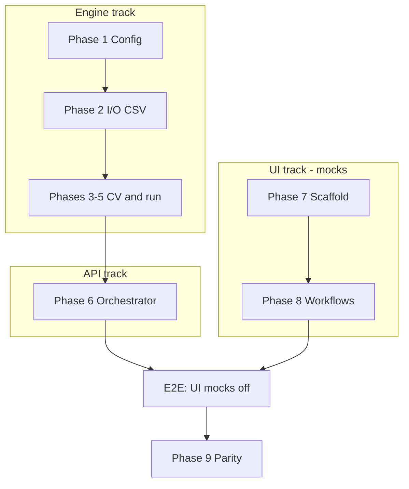

# Parallel Agent Development

How to run **Engine**, **UI**, and **API** tracks concurrently without integration drift.

**Kickoff copy-paste prompts:** [`KICKOFF_PROMPTS.md`](KICKOFF_PROMPTS.md)  
**Contract rules:** [`CONTRACT_SYNC.md`](CONTRACT_SYNC.md)

---

## Track summary

| Chat / agent | Phases | Owned paths | Start when |
|--------------|--------|-------------|------------|
| **Engine** | 1–5 | `src/viana/`, `tests/viana/`, `configs/` | **Now** |
| **UI** | 7–8 | `apps/web/`, `docs/ui/` | **Now** (mocks only) |
| **API** | 6 | `src/orchestrator/` | **After Phase 5** (`viana run` works); design-only earlier OK |

---

## When to start the API chat?

| API work type | Start when | Safe in parallel with |
|---------------|------------|-------------------------|
| Read contracts, plan routes, job state machine | Anytime | Engine 1–5, UI 7–8 |
| Scaffold routers (501 stubs) | Phase 5 in progress | UI 7–8 |
| **Real workers** spawning `viana run` | **Phase 5 complete** | UI still on mocks |
| WebSocket telemetry from engine stdout | Phase 5 + process loop | UI 8 |
| **UI turns off mocks** (`USE_MOCKS=false`) | **Phase 6 endpoints ✅** in `PROJECT_STATUS.md` | After UI 7 scaffold exists |

**Answer:** Open the API chat early for **reading and design**, but **do not** implement GPU workers or real job execution until `python -m viana run` succeeds on a test config. UI does **not** block API start; **engine `viana run`** blocks API implementation.

---

## Integration timeline



**ASCII fallback (same story):**

```
Engine:  [Phase 1] → [Phase 2] → [Phases 3-5] ──→ [Phase 6 API] ──→ [E2E]
UI:      [Phase 7] ─────────→ [Phase 8] ────────────────────────→ [E2E]
                                                                      ↓
                                                               [Phase 9 Parity]
```

| Week (indicative) | Engine | UI | API |
|-------------------|--------|-----|-----|
| 1 | Phase 1 | Phase 7 scaffold | — |
| 2 | Phase 2 | Phase 7 finish | — |
| 3–5 | Phases 3–5 | Phase 8 workflows | Design only |
| 6–7 | Hardening | Phase 8 + polish | Phase 6 implement |
| 8 | Parity prep | `USE_MOCKS=false` | WS + queue |
| 9+ | Phase 9 | E2E testing | Production hardening |

---

## Sync points (human or PR)

1. **Contract change** — merge schema + fixture before any track uses new fields (`CONTRACT_SYNC.md`).
2. **Phase 5 done** — engine demo: `viana run` on sample config; unblocks API workers.
3. **Phase 6 matrix** — flip endpoints to ✅ in `PROJECT_STATUS.md` one at a time.
4. **Phase 7 done** — UI builds; `npm run build` passes.
5. **E2E** — UI `NEXT_PUBLIC_USE_MOCKS=false`, container up, real job submit.

---

## One chat per track (recommended)

- **Do not** mix Engine + UI implementation in one chat.
- **OK** to continue one Engine chat across Phases 1–5 (shared context).
- **OK** to continue one UI chat across Phases 7–8.
- Start a **fresh API chat** when beginning Phase 6 implementation (after Phase 5).

Coordination = git + `packages/contracts/` + `PROJECT_STATUS.md`, not shared chat memory.
