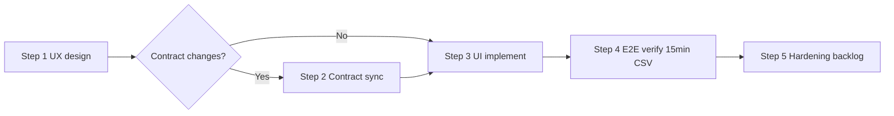

# Post-v0.1 plan (Steps 1–5)

**Context:** Implementation Phases 0–9 are complete. Remaining work is product polish — prescan UX, wall-clock metadata, `{stem}_15min.csv` verification — then optional hardening.

**Terminology:** **Phase** = original 0–9 build. **Step** = post-v0.1 work (numbered **1–5**).

**Agents:** On start/complete of any Step, follow [`AGENT_PROGRESS.md`](AGENT_PROGRESS.md).

---

## Chat strategy

**Start new chats** for all Steps. Archive Phase 1–9 build chats.

| Old chat | Use when |
|----------|----------|
| Engine (Phases 1–5) | Engine bugs, `time_map` / aggregate fixes only |
| API (Phase 6) | Route, worker, cancel behavior only |
| UI (Phases 7–8) | Do not continue — start **UI v2** for Step 3 |
| Planning | Planning only — not implementation |

---

## Timeline

---

## Step 1 — UX design

**Chat:** New — UX design (design-only)  
**Detail:** [`STEP_1_UX_DESIGN.md`](STEP_1_UX_DESIGN.md)

---

## Step 2 — Contract sync (conditional)

**Chat:** New — Contract (only if Step 1 proposes schema changes)  
**Detail:** [`STEP_2_CONTRACT_SYNC.md`](STEP_2_CONTRACT_SYNC.md)

---

## Step 3 — UI implementation

**Chat:** New — UI implementation v2  
**Detail:** [`STEP_3_UI_IMPLEMENTATION.md`](STEP_3_UI_IMPLEMENTATION.md)

---

## Step 4 — E2E verification

**Chat:** UI v2 or QA  
**Detail:** [`STEP_4_E2E_VERIFICATION.md`](STEP_4_E2E_VERIFICATION.md)

---

## Step 5 — Hardening backlog

**Chat:** Per item (API / UI / Engine / DevOps)  
**Detail:** [`STEP_5_HARDENING.md`](STEP_5_HARDENING.md)

---

## Chat map

| Step | Objective | Chat |
|------|-----------|------|
| 1 | UX redesign | New — UX design |
| 2 | Contract changes (if any) | New — Contract |
| 3 | UI implementation | New — UI v2 |
| 4 | 15-min CSV verification | UI v2 or QA |
| 4 (engine bug) | `time_map` / aggregate fix | Engine (narrow) |
| 5+ | Hardening | Per Step 5 table |
