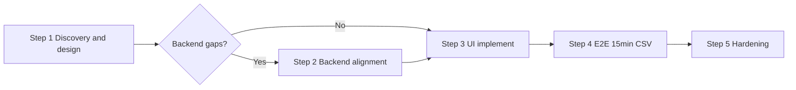

# Post-v0.1 plan (Steps 1–5)

**Context:** Phases 0–9 complete. Next: **discover UX goals** → align backend if needed → implement UI → verify `_15min.csv` → harden.

**Terminology:** **Phase** = 0–9 build. **Step** = post-v0.1 (numbered **1–5**).

**Agents:** Follow [`AGENT_PROGRESS.md`](AGENT_PROGRESS.md) on start/complete.

---

## Chat strategy (new vs reuse)

| Situation | Use |
|-----------|-----|
| Step 1 discovery + design | **One new chat** — Q&A and `REDESIGN.md` in same thread |
| Paused Step 1, resume later | **New chat** with Step 1 kickoff + read `docs/ui/DISCOVERY.md` progress |
| Step 2 backend work | **New chat(s)** — Contract / Engine / API; never Phase 1–9 build chats |
| Step 3 UI build | **New chat** — UI v2 |
| Step 4 QA | **New** or continue Step 3 chat |
| This planning thread | **Do not** use for implementation |

---

## Timeline

---

## Step 1 — UX discovery & design

**Chat:** New — interactive discovery, then design finalize  
**Detail:** [`STEP_1_UX_DESIGN.md`](STEP_1_UX_DESIGN.md) · [`docs/ui/DISCOVERY.md`](../ui/DISCOVERY.md)

**Key idea:** Agent asks questions, records answers, builds task-type prescan matrix (`ViAna_Moving`: propose time/location/lines → user confirms/edits). Then writes `REDESIGN.md`.

---

## Step 2 — Backend alignment (conditional)

**Chat:** New — Contract / Engine / API as needed  
**Detail:** [`STEP_2_BACKEND_ALIGNMENT.md`](STEP_2_BACKEND_ALIGNMENT.md)

Contract changes **and** prescan engine/API implementation if Step 1 requires it.

---

## Step 3 — UI implementation

**Chat:** New — UI v2  
**Detail:** [`STEP_3_UI_IMPLEMENTATION.md`](STEP_3_UI_IMPLEMENTATION.md)

---

## Step 4 — E2E verification

**Chat:** UI v2 or QA  
**Detail:** [`STEP_4_E2E_VERIFICATION.md`](STEP_4_E2E_VERIFICATION.md)

---

## Step 5 — Hardening

**Chat:** Per backlog item  
**Detail:** [`STEP_5_HARDENING.md`](STEP_5_HARDENING.md)

---

## Chat map

| Step | Objective | Chat |
|------|-----------|------|
| 1 | Discovery Q&A + UX spec | **New** — one chat for full Step 1 |
| 2 | Contract + prescan backend | **New** — Backend (split Engine/API if large) |
| 3 | UI implementation | **New** — UI v2 |
| 4 | 15-min CSV verification | New QA or continue Step 3 |
| 5+ | Hardening | Per item |
