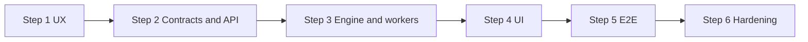

# Post-v0.1 plan (Steps 1–6)

**Context:** Phases 0–9 complete. Post-v0.1 work is **six Steps** — backend split into contract/API (2) then engine/workers (3).

**Agents:** Follow [`AGENT_PROGRESS.md`](AGENT_PROGRESS.md) on start/complete.

---

## Chat strategy

| Step | Chat |
|------|------|
| **1** | One new chat (discovery + design); resume → new chat + `DISCOVERY.md` |
| **2** | **New** — Contract + API |
| **3** | **New** — Engine + orchestrator workers |
| **4** | **New** — UI v2 |
| **5** | New QA or continue Step 4 |
| **6** | New per backlog item |
| Phase 1–9 / Step 1 chats | **Do not reuse** for implementation |

---

## Timeline

---

| Step | Name | Detail |
|------|------|--------|
| 1 | UX discovery & design | [`STEP_1_UX_DESIGN.md`](STEP_1_UX_DESIGN.md) |
| 2 | Contracts & API foundation | [`STEP_2_CONTRACTS_AND_API.md`](STEP_2_CONTRACTS_AND_API.md) |
| 3 | Engine prescan & orchestrator | [`STEP_3_ENGINE_AND_ORCHESTRATOR.md`](STEP_3_ENGINE_AND_ORCHESTRATOR.md) |
| 4 | UI implementation | [`STEP_4_UI_IMPLEMENTATION.md`](STEP_4_UI_IMPLEMENTATION.md) |
| 5 | E2E verification | [`STEP_5_E2E_VERIFICATION.md`](STEP_5_E2E_VERIFICATION.md) |
| 6 | Hardening | [`STEP_6_HARDENING.md`](STEP_6_HARDENING.md) |

---

## Chat map

| Step | Objective | Chat |
|------|-----------|------|
| 1 | Discovery + REDESIGN | New — UX |
| 2 | Schemas, intake, confirm APIs | New — Contract + API |
| 3 | Prescan engine, workers, aggregate | New — Engine + workers |
| 4 | UI against new APIs | New — UI v2 |
| 5 | 15-min CSV E2E | QA |
| 6+ | Hardening | Per item |
