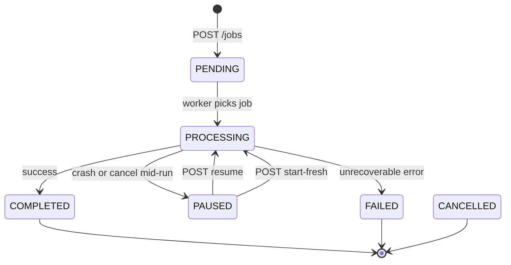

# Job State Machine

## UI actions by state

| State | UI shows | Actions |
|-------|----------|---------|
| PENDING | Queue position | Cancel |
| PROCESSING | Progress bar, optional telemetry | Pause, Cancel |
| PAUSED | **Flash / highlight** video | Resume, Start fresh, Cancel |
| COMPLETED | Output file links | Re-aggregate |
| FAILED | Error message | Start fresh (if checkpoint) |
| CANCELLED | — | Remove from queue view |

## Checkpoint

- File: `{output_dir}/_meta/{stem}/checkpoint.json` (ADR 003). Legacy flat `{output_dir}/{stem}.checkpoint.json` is still read for PAUSED resume.
- `checkpoint_exists: true` only for PAUSED/FAILED with an **incomplete** checkpoint on disk
- Engine never auto-resumes on plain `POST /jobs` if checkpoint exists → API returns **409**
